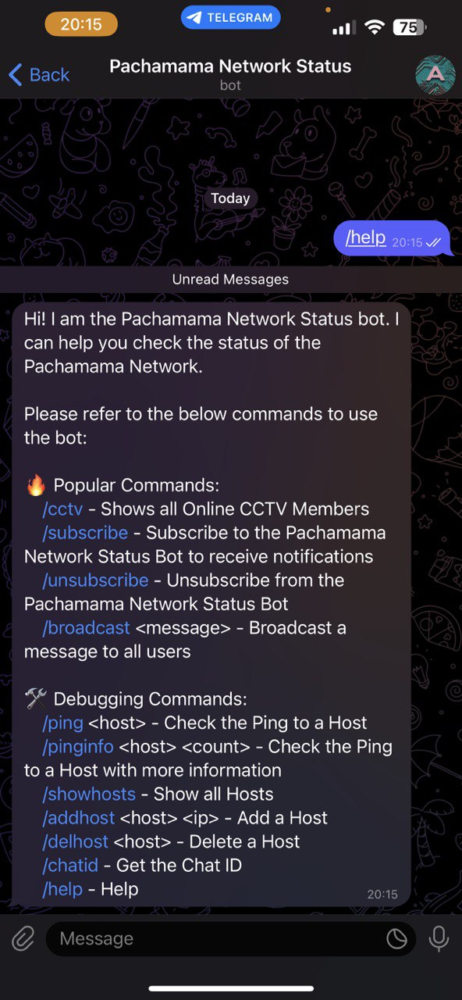

# Pachamama Network Status Telegram Bot

## Introduction

The Pachamama Network Status Telegram Bot is designed to provide real-time updates and notifications regarding the status of networks within Pachamama Group. With this bot, users can stay informed about network outages, restoration of services, user logins, and receive important announcements from the bot.

**@PachamamaNetwork_bot**

**Important Note:**
Please be aware that this project is still in development and may contain bugs or lack comprehensive error handling. Therefore, we advise proceeding with caution when using this codebase in a production environment or critical systems.

## Key Features

1. **Network Status Updates:** Our bot constantly monitors the network infrastructure and promptly notifies users of any network outages or service interruptions.

2. **User Login Tracking:** The bot logs user login and logout activities, helping to ensure network security and user accountability.

3. **Global Broadcast Messages:** Administrators can send important broadcast messages to all subscribed users through the bot.

4. **Subscription Management:** Users have the option to subscribe or unsubscribe from receiving network status notifications as per their preferences.

| Help | Subscription | Status |
| --- | --- | --- |
|  |  |  |


Any new features will be posted and updated.

## Contributors

This project was collaboratively developed by Mo and Arnav. Many thanks to the developers at [python-telegram-bot](https://github.com/python-telegram-bot/python-telegram-bot) which serves as the backbone.

## Setup

The bot is currently hosted in a docker container. Here are the steps to run your own bot with the same functionality:

-------------------------------
### Telegram

Bot token is required from [telegram](https://core.telegram.org/bots/api).

-------------------------------
### Docker

1. Clone the repository

```bash
$ git clone git@github.com:owen97779/Pachamama-Telegram-Bot.git
```

2. Create docker image from Dockerfile, include the token **INSERT-TOKEN** of your bot. If CCTV monitoring is required, use the **CCTV_SERVER_HOST** and **CCTV_MQTT_TOPIC** arguments. Python and all dependencies will also load.

```bash
$ docker build --build-arg TOKEN='INSERT-TOKEN' --build-arg CCTV_SERVER_HOST='INSERT-HOST' --build-arg CCTV_MQTT_TOPIC='INSERT-MQTT' -t IMAGE-NAME .
```

3. Run docker

```bash
$ docker run IMAGE-NAME
```

-------------------------------
### Python Standalone

1. Environment can be created from [**environment.yml**](environment.yml).

2. Edit/replace the environment files in the [**bot.py**](telegrambot/bot.py) with your own strings.

```python
def main():
    # with open("TOKEN.env", "r") as file:
    #     TOKEN = file.read().replace("\n", "")

    TOKEN = os.getenv("TOKEN")
    CCTV_SERVER_HOST = os.getenv("CCTV_SERVER_HOST")
    CCTV_MQTT_TOPIC = os.getenv("CCTV_MQTT_TOPIC")
```

3. Run bot.py from telegrambot directory.

```bash
$ python bot.py
```